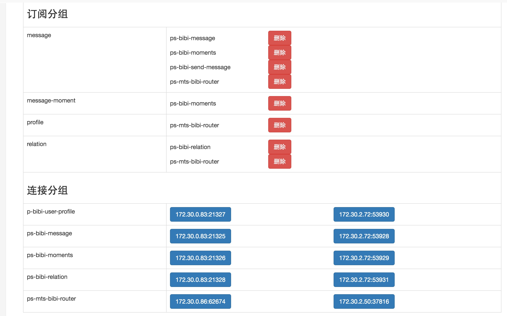

# kiteq-ops

#### 简介
    - 提供[kiteq](https://github.com/blackbeans/kiteq)的系统指标的图表展示
    - 节点存活
    - kiteq系统指标告警(需要对接自己的告警平台)
    - 删除订阅分组
    - 订阅分组、kiteserver的流量展示
    
#### 对接告警平台：
实现的[alarm_entry.go](https://github.com/blackbeans/kiteq-ops/blob/master/app/models/alarm/alarm_entry.go#L22)WrapAlaramParams方法，期望返回报警系统的完整的URL。即可实现和报警系统对接
    
#### 安装：
    
[revel安装](http://revel.github.io/tutorial/gettingstarted.html)
    
sh build.sh

revel run kiteq-ops

#### demo

